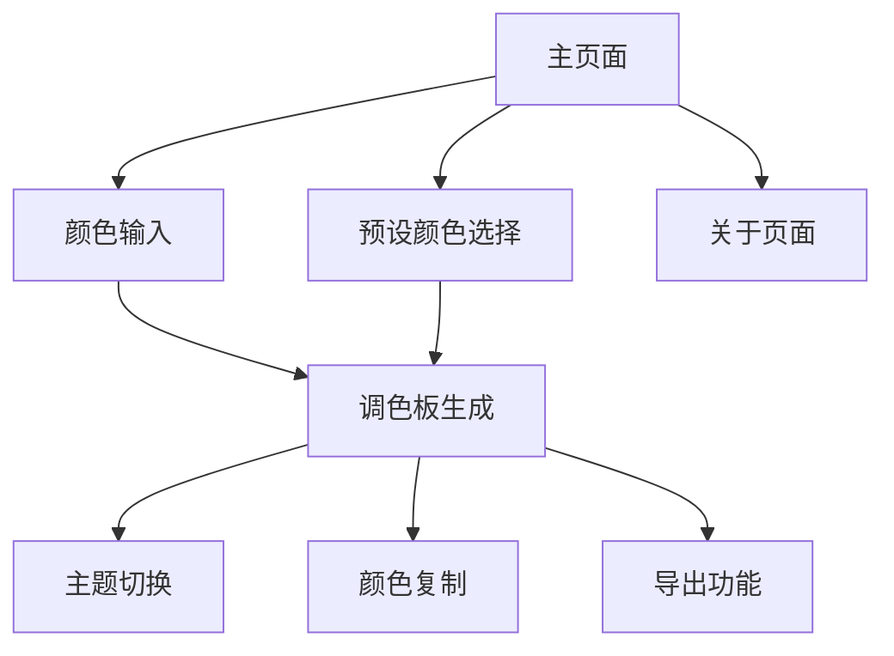

# Ant Design 颜色生成器网页应用产品需求文档

## 1. 产品概述

基于 Ant Design Colors 库创建一个可视化的网页界面，用户可以通过输入任意颜色值生成完整的10色梯度调色板。
支持浅色和深色主题模式，提供直观的颜色展示和便捷的复制功能，帮助设计师和开发者快速获取符合 Ant Design 规范的颜色方案。

## 2. 核心功能

### 2.1 用户角色

| 角色 | 注册方式 | 核心权限 |
|------|----------|----------|
| 默认用户 | 无需注册，直接访问 | 可使用所有颜色生成和展示功能 |

### 2.2 功能模块

我们的颜色生成器需求包含以下主要页面：
1. **主页面**：颜色输入区域、调色板展示区域、主题切换、预设颜色选择
2. **关于页面**：产品介绍、使用说明、技术说明

### 2.3 页面详情

| 页面名称 | 模块名称 | 功能描述 |
|----------|----------|----------|
| 主页面 | 颜色输入区域 | 提供颜色选择器和文本输入框，支持HEX、RGB、HSL等格式输入 |
| 主页面 | 调色板展示区域 | 显示生成的10色梯度调色板，每个颜色块显示颜色值和索引 |
| 主页面 | 主题切换 | 在浅色和深色主题间切换，实时更新调色板 |
| 主页面 | 预设颜色选择 | 展示Ant Design预设的13种颜色，点击快速生成对应调色板 |
| 主页面 | 颜色复制功能 | 点击颜色块复制颜色值到剪贴板，支持批量复制整个调色板 |
| 主页面 | 导出功能 | 支持导出为CSS变量、JSON格式、设计工具格式 |
| 关于页面 | 产品介绍 | 介绍Ant Design颜色生成算法和应用场景 |
| 关于页面 | 使用说明 | 详细的操作指南和功能说明 |

## 3. 核心流程

用户访问网站后，可以通过颜色选择器或直接输入颜色值来指定基础颜色。系统会实时生成包含10个梯度的调色板，用户可以在浅色和深色主题间切换查看效果。用户还可以选择预设的Ant Design颜色快速生成调色板，并通过点击复制功能获取所需的颜色值。

## 4. 用户界面设计

### 4.1 设计风格

- **主色调**：#1677FF（Ant Design蓝）和#00B96B（成功绿）
- **辅助色**：#F5F5F5（浅灰背景）、#FFFFFF（白色）、#141414（深色背景）
- **按钮样式**：圆角按钮，支持悬停和点击状态
- **字体**：-apple-system, BlinkMacSystemFont, 'Segoe UI', Roboto, 14px主要文字，12px辅助文字
- **布局风格**：卡片式布局，顶部导航，响应式设计
- **图标风格**：使用Ant Design图标库，简洁线性风格

### 4.2 页面设计概览

| 页面名称 | 模块名称 | UI元素 |
|----------|----------|--------|
| 主页面 | 颜色输入区域 | 颜色选择器（圆形色盘）、文本输入框（支持多种格式）、实时预览色块 |
| 主页面 | 调色板展示区域 | 10个颜色块横向排列，每块显示颜色值、索引号、复制按钮 |
| 主页面 | 主题切换 | 切换开关组件，月亮/太阳图标，平滑过渡动画 |
| 主页面 | 预设颜色选择 | 13个预设颜色圆形按钮，悬停显示颜色名称 |
| 主页面 | 导出功能 | 下拉菜单按钮，支持多种导出格式 |
| 关于页面 | 内容区域 | 卡片式布局，图文并茂，代码示例高亮显示 |

### 4.3 响应式设计

产品采用移动优先的响应式设计，在桌面端提供最佳体验，在移动端保持核心功能可用。颜色块在小屏幕上会调整为垂直排列，确保触摸操作的便利性。